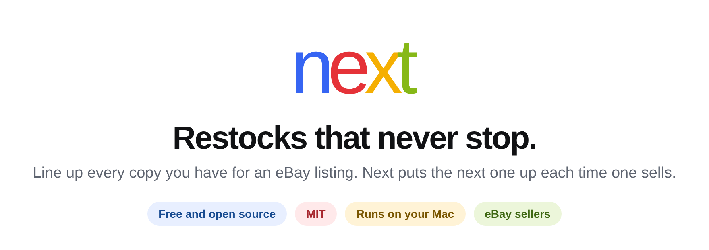
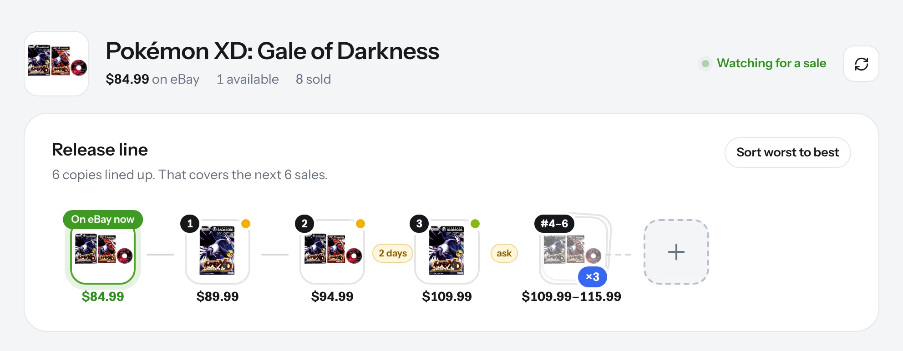
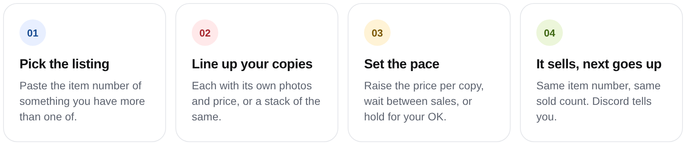
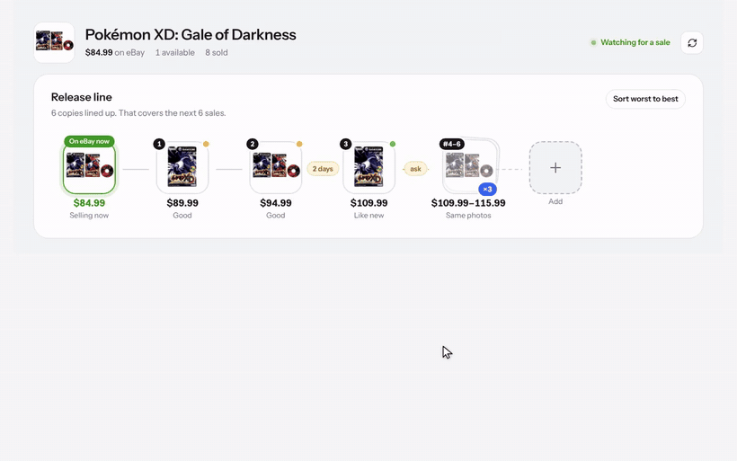

<p align="center">
  <picture>
    <source media="(prefers-color-scheme: dark)" srcset=".github/readme/header-dark.png">
    
  </picture>
</p>

<p align="center">
  <a href="https://nextinstock.com"><b>nextinstock.com</b></a> &nbsp;·&nbsp;
  <a href="https://nextinstock.com/docs"><b>Setup guide</b></a> &nbsp;·&nbsp;
  <a href="DISCORD_SETUP.md"><b>Discord alerts</b></a>
</p>

<p align="center">
  
</p>

Next keeps an eBay listing in stock for you. Line up every copy you have, each with its own photos and price or a stack of the same. When one sells, Next puts the next one up on the **same item number**, so the listing keeps its sold count instead of starting over.

<p align="center">
  <picture>
    <source media="(prefers-color-scheme: dark)" srcset=".github/readme/steps-dark.png">
    
  </picture>
</p>

<p align="center">
  
</p>

## Quick start

You need a Mac with Node.js 22+, an eBay seller account, and your own eBay developer keys.

```bash
git clone https://github.com/beenhad/Nextinstock.git
cd Nextinstock
npm ci
npm run setup:local      # creates .env.local and a private data folder
npm run build
npm run start:local      # app + worker
```

Open [127.0.0.1:3000/tool](http://127.0.0.1:3000/tool). Put your eBay keys in `.env.local` (never in a chat or a commit). Next starts in **test mode** and won't change anything on eBay until you turn live mode on.

The full walkthrough is at **[nextinstock.com/docs](https://nextinstock.com/docs)**. Prefer to set up with an AI assistant? Follow [INSTALL_WITH_AI.md](INSTALL_WITH_AI.md).

## What it does

- **Different copies:** each one has its own photos, condition, price and note. Buyers see exactly the copy they'll get.
- **Same copies:** stack as many as you have on the listing's existing photos, and step the price up per copy if you want.
- **Pace:** each copy goes up right away, after a wait you choose, or only when you say so.
- **Variations:** pick the exact option and Next restocks that option's quantity and price.
- **Discord alerts:** get a message on every sale and restock, plus a *Put it up* link when a copy is waiting on you.
- **Local:** runs on your Mac. Your keys, photos and history never leave it.

Works with active fixed-price, Good 'Til Cancelled listings with eBay's Out-of-Stock Control turned on.

<details>
<summary><b>How a restock works</b></summary>

1. The worker checks your listings every 30 seconds (`NEXTINSTOCK_POLL_SECONDS`).
2. A sale takes the listing or variation to zero. Out-of-Stock Control keeps it alive.
3. Next waits at least 60 seconds by default, or longer if you set a wait for that copy (`NEXTINSTOCK_RESTOCK_DELAY_SECONDS`, 15–900).
4. For a single-item listing it uploads that copy's photos, updates the condition note and price, reads the listing back to confirm, then sets quantity to 1.
5. For a variation, eBay needs price and quantity in one revision, so Next applies both together and confirms them.
6. The next copy in line moves up.

Each sale gets exactly one handoff. If eBay accepts a change but the confirmation fails, the next check reads eBay first and reconciles before trying again. Changing a price can reset automatic Best Offer thresholds, so check those if you use them.
</details>

<details>
<summary><b>Turning on live restocks</b></summary>

Reading listings only needs a read grant. Writing needs a grant with this scope:

```text
https://api.ebay.com/oauth/api_scope/sell.inventory
```

1. In the eBay developer portal, set your RuName's accepted URL to `https://<your-stable-host>/api/ebay/auth/callback`.
2. In Next, open **Settings** and choose **Allow listing updates**.
3. Let a dry run play out and check the history.
4. Set `NEXTINSTOCK_EBAY_WRITE_MODE=live` in `.env.local` and restart `npm run start:local`.

Live writes need both the `live` setting and the stored write grant. The environment variable alone unlocks nothing.
</details>

<details>
<summary><b>Where your data lives</b></summary>

`npm run setup:local` points `NEXTINSTOCK_DATA_DIR` at `~/Library/Application Support/Nextinstock`, outside the project folder, so `git pull` never touches it. Without that setting it falls back to `.nextinstock/` (gitignored):

```text
nextinstock.sqlite   listings, copies and history
images/              copy photos
secrets.json         eBay grant and Discord webhook (mode 600)
```

Back it up like any other business data.
</details>

## Updating

```bash
git pull && npm ci && npm run build && npm run start:local
```

Your `.env.local` and data folder are left alone.

## Contributing

Issues and pull requests are welcome. Before opening a PR, run:

```bash
npm run check && npm test && npm run build
```

Never commit `.env.local` or the data folder. The marketing site (`/` and `/docs`) deploys to Vercel, and the hosted build blocks every tool route, so the tool only runs on your own machine.

## License

[MIT](LICENSE). Independent software for eBay sellers, not affiliated with eBay.
